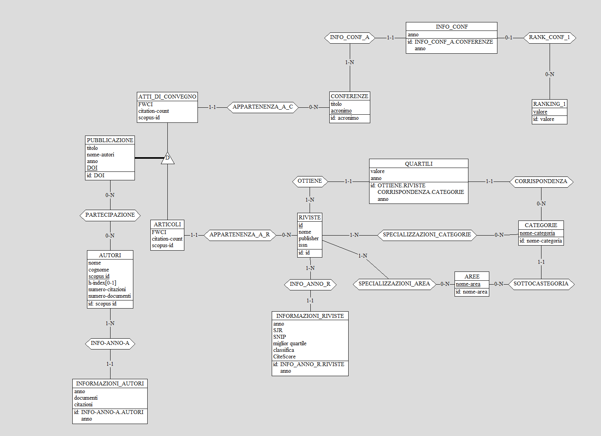
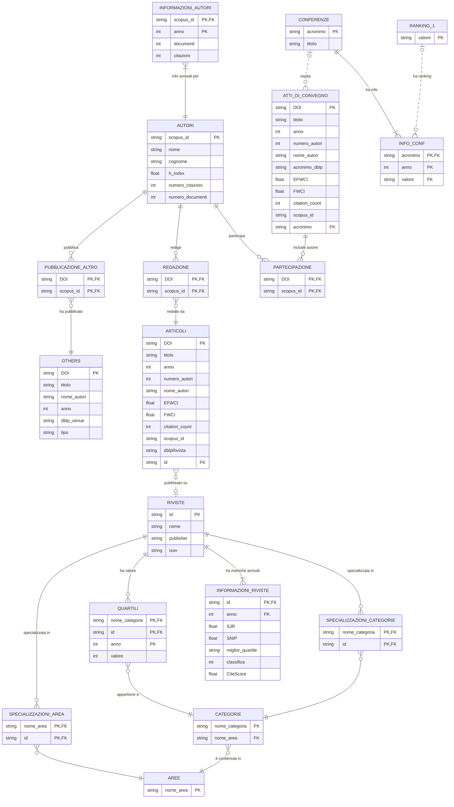

# DocRanks - Database

## Introduzione

Il database di DocRanks è progettato per contenere le informazioni di vari siti diversi unendole in una sola struttura.

## Schema ER del database

## Descrizione delle Tabelle

### AUTORI

In autori vengono inserite le informazioni principali sugli autori,

**Attributi:**

- `scopus_id` (PK): Identificativo Scopus univoco dell'autore e chiave primaria.
- `nome`: Nome dell'autore
- `cognome`: Cognome dell'autore
- `h_index`: Indice H dell'autore (misura di produttività e impatto del ricercatore), questa misura di default è null, ma l'utente può inserirla manualmente.
- `numero_citazioni`: Totale citazioni ricevute
- `numero_documenti`: Totale pubblicazioni

### INFORMAZIONI_AUTORI

Statistiche annuali per ogni autore.

**Attributi:**

- `scopus_id` (PK, FK): Riferimento all'autore
- `anno` (PK): Anno di riferimento
- `documenti`: Numero documenti pubblicati nell'anno
- `citazioni`: Citazioni ricevute nell'anno

### ARTICOLI

Pubblicazioni sulle riviste, i dati vengono ottenuti da Scopus e DBLP, il DOI è obbligatorio per collegare le due fonti.

**Attributi:**

- `DOI` (PK): Digital Object Identifier univoco e obbligatorio per collegare dblp e scopus
- `titolo`
- `anno`: Anno di pubblicazione
- `numero_autori`
- `nome_autori`: Lista degli autori
- `EFWCI`: Expected Field-Weighted Citation Impact, una approssimazione del Field-Citation-Imact che non può essere preso da scopus
- `FWCI`: Field-Weighted Citation Impact, misura proprietaria di Scopus, di default a null, ma l'utente può inserirla manualmente.
- `citation_count`
- `scopus_id`: eid Scopus della pubblicazione
- `dblpRivista`: Nome rivista come appare in DBLP (solitamente abbreviato)

### AREE

Contiene le aree di ricerca con cui vengono classificate le riviste secondo [Scimago Journal and Ranking](https://www.scimagojr.com/journalrank.php) (es. Computer Science, Agricultural and Biological Sciences ...).

### CATEGORIE

Come le aree contiene le categorie di ricerca con cui vengono classificate le riviste secondo [Scimago](https://www.scimagojr.com/journalrank.php) (es. Computer Vision, Artificial Intelligence ...).

Sia in aree che in categorie se il software individua un'area o una categoria che non è presente nel database, la classifica come Other.

### RIVISTE

Tabella in cui vengono salvate le informazioni raccolte da [Scimago](https://www.scimagojr.com/journalrank.php).

**Attributi:**

- `id` (PK): Identificativo univoco della rivista `Sourceid`, usato anche per collegare articoli e riviste quando possibile.
- `nome`
- `publisher`
- `issn`: Codice ISSN della rivista

### INFORMAZIONI_RIVISTE

Informazioni annuali delle riviste ottenute da [SciMago JR](https://www.scimagojr.com/journalrank.php) e [Scopus](https://www.scopus.com/sources.uri?zone=TopNavBar&origin=).

**Attributi:**

- `id` (PK, FK): Riferimento alla rivista (Sourceid)
- `anno` (PK): Anno di riferimento
- `SJR`: misura di impatto della rivista secondo SCImago Journal Rank
- `SNIP`: Source Normalized Impact per Paper, misura ottenuta da scopus, può essere null se non è presente nella cartella [scopus](uploads/scopus)
- `miglior_quartile`
- `classifica`: Posizione nel ranking SJR
- `CiteScore`: Metrica Scopus di impatto citazionale, come il SNIP può essere null se non è presente nella cartella [scopus](uploads/scopus)

### QUARTILI

Quartili delle riviste per categoria e anno.

**Attributi:**

- `nome_categoria` (PK, FK): Categoria di valutazione
- `id` (PK, FK): Rivista valutata
- `anno` (PK)
- `valore`: Valore del quartile (1-4)

### ATTI_DI_CONVEGNO

Paper pubblicati nelle conferenze. Come per gli articoli i dati vengono ottenuti da Scopus e DBLP, il DOI è obbligatorio per collegare le due fonti.

**Attributi:**

- `DOI` (PK): Digital Object Identifier univoco e obbligatorio per collegare dblp e scopus
- `titolo`
- `anno`: Anno di pubblicazione
- `numero_autori`
- `nome_autori`: Lista degli autori
- `acronimo_dblp`: Nome dell'acronimo come appare in DBLP
- `EFWCI`: Expected Field-Weighted Citation Impact
- `FWCI`: Field-Weighted Citation Impact
- `citation_count`
- `scopus_id`: eid Scopus della pubblicazione
- `acronimo` (FK): Riferimento alla conferenza mappata, tramite acronimo, in caso di errore l'utente può inserire manualmente l'acronimo della conferenza. Se la conferenza non è prensente nel db allora l'utente vedrà una conferenza fittizia a rank F.

### CONFERENZE

Contiene le conferenze ottenute su [CORE](https://portal.core.edu.au/conf-ranks/).

**Attributi:**

- `acronimo` (PK): Acronimo della conferenza su CORE, viene usato per collegare le conferenze agli atti di convegno.
- `titolo`: Nome completo della conferenza ottenuto da CORE

### INFO_CONF

Ranking annuale delle conferenze secondo CORE. Se il ranking non è presente per quell'anno verrà inserito un ranking con valore F.

**Attributi:**

- `acronimo` (PK, FK): Riferimento alla conferenza
- `anno` (PK): Anno di riferimento
- `valore` (FK): Ranking CORE (A*, A, B, C, F)

### RANKING_1

Valori possibili per i ranking delle conferenze.

**Attributi:**

- `valore` (PK): Valore del ranking (A*, A, B, C, ...)

### OTHERS

Altre tipologie di pubblicazioni, i dati sono ottenuti da dblp.

**Attributi:**

- `DOI` (PK)
- `titolo`
- `nome_autori`
- `anno`
- `dblp_venue`: *Origine* della pubblicazione come appare in DBLP
- `tipo`: Tipologia di pubblicazione

### Altre Tabelle

Le tabelle restanti:

- SPECIALIZZAZIONI_AREA
- SPECIALIZZAZIONI_CATEGORIE
- REDAZIONE
- PARTECIPAZIONE
- PUBBLICAZIONE_ALTRO

sono tabelle di collegamento tra le classi.

## Schema relazionale del Database

